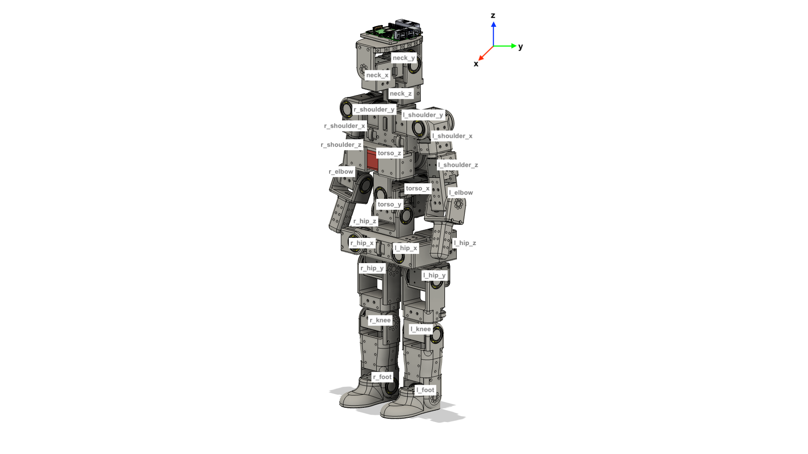

The file `humanoid.py` contains code for setting the robot in different positions. At the top of the file, there are constants referring to the different motors. The motors are named as shown in this image:

Where the post-fixes _x, _y, and _z denote the axis around which the motor rotates when the robot is in the position shown in the image, and where the coordinate system is shown in the top right of the image above.

## Demo instructions

### 1. Charge batteries

The three batteries need to be charged using the SKYRC S65 charger in the lab. With the Conrad 3S, 2400mAh, 20C LiPo batteries, it should be done as follows:

> ⚠️ **Warning**: Make sure that you use the correct battery settings when charging the LiPo battery. Wrong battery settings may result in the battery catching fire. Don't leave a charging LiPo battery unattended.
 
1. Gather the LiPo battery, the SKYRC charger, and the LiPo safety bag: 

 
2. Put the LiPo battery in the safety bag:

 
3. Connect the battery's XT60 connector and balancer to the SKYRC charger:
   

 
4. Double check that the charger settings are correct. Your charger settings should be the same as can be seen in the image below. Then, hold in the "Start" button until the charger beeps. You will be prompted to confirm or cancel. If you are sure that the charger settings are correct, select "Confirm" by pressing the "Start" button:

 
5. When the battery has reached above 11.1V, press the "Stop" button and unplug the battery: 

### 2. Place batteries in the humanoid

 
1. Place the battery in the front:

 
2. Seal the front battery holder with M3x8mm screws, which can be found in the lab:

 
3. Place the two batteries in the back:

 

4. Seal the back battery holder, with the same M3x8mm screws:

 

5. Connect the battery cables to the XT60 parallel adapters. The front battery cable should go to the lower XT60 connector, as shown here:

### 3. Connect your computer to the U2D2

### 4. Run the python scripts.

Make sure that you have dynamixel_sdk installed on your computer. Instructions for installing on linux can be found [here](https://emanual.robotis.com/docs/en/software/dynamixel/dynamixel_sdk/library_setup/python_linux/#python-linux) Then, run the `main.py` file, replacing `humanoid.go_to_base_position()` with a call to any of the other position functions in `humanoid.py`. It is good to hold the humanoid above the ground before starting a script, as this ensures that the motors will be able to go to their starting positions properly. 
